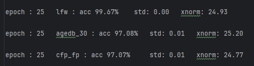

# FaceNeXt
combine mobilefacenet and ConNeXt, we proudly release FaceNeXt, which may reach a higher performance on many stages.

🤗update: 2025-07-26 pretrain part finish. Which is a self-supervised learning based training
* pretrained visualization

🤗update: 2024-07-30 finetune part finish. use arcface loss to train the pretrain self-supervised learning model
* beautiful loss curve😀 

🤗update: 2024-8-5 fix arcface loss bug, add cosface loss together

😊update:2024-8-16 add arcface loss and gan loss at pretrain phrase, made some experiments on the performance of the model
* 25 epoch finetune on MS1MV3

